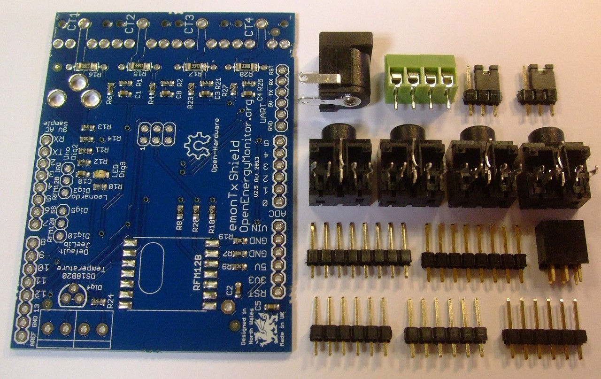
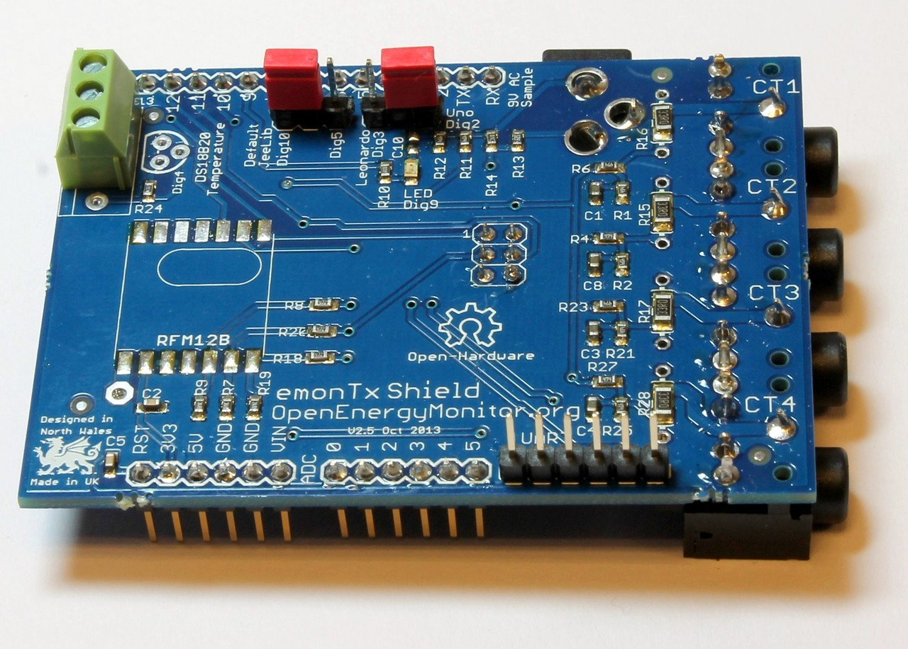
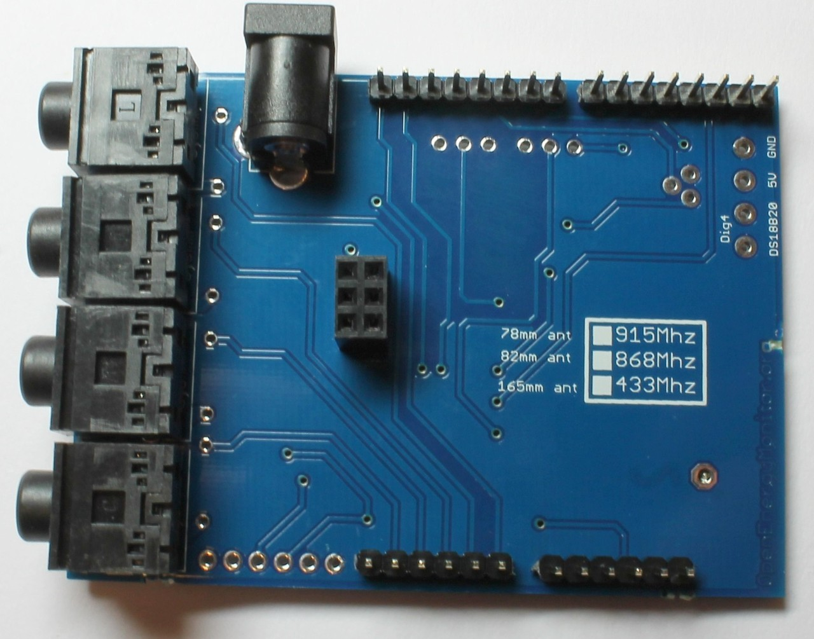
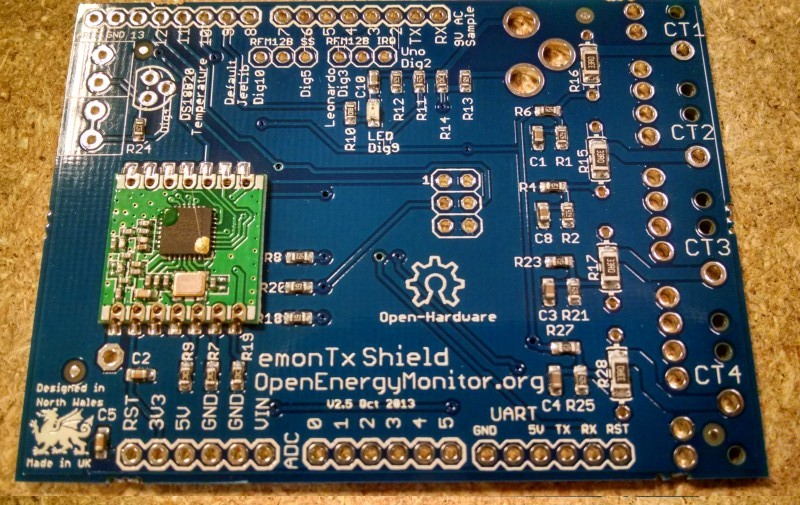
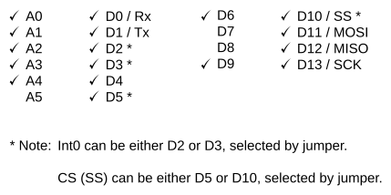

# emontx-shield

An open-hardware wireless energy monitoring Arduino compatible shield.

[Purchase from OpenEnergyMonitor shop](http://shop.openenergymonitor.com/emontx-shield/)


## Overview

- Apparent Power, Real Power*, Power Factor* and AC RMS voltage readings* 
- 4 x CT Current Sensor inputs
- AC 9V RMS voltage sensor input
- 433/868MHz RFM12B  / RFM69CW(HopeRF) wireless transceiver to transmit/receive data to other OpenEnergyMonitor and JeeNode modules
- On-board DS18B20 digital temperature sensor (not included as standard)
- Status LED
- Compatible with Duemilanove, Uno and Leonardo
- Compatible with OpenEnergyMonitor modules (emonGLCD, emonBase - NannodeRF etc.)

*with 9V AC adapter

## Design Files & Part List

See OpenEnergyMonitor Shop for [recommended CT](http://shop.openenergymonitor.com/100a-max-clip-on-current-sensor-ct) and [recommended plug-in AC-AC adapter](http://shop.openenergymonitor.com/components/).

See [Learn: Electricity Monitoring](https://docs.openenergymonitor.org/electricity-monitoring/index.html) for more information on CTs and AC-AC adapters.

## Build Guide



You will need to add the various connectors to the pre-assembled circuit board:

The RFM12B / RFM69CW radio module goes onto the pads marked with its outline, ensuring that it is the correct way round. If you are in any doubt about the orientation of the radio module, the antenna pin on the radio is at the top left in all the photos here [link](https://learn.openenergymonitor.org/electricity-monitoring/networking/which-radio-module), and it must line up with the antenna pad, which is next to the large hole by C2.

You must solder an antenna into that large hole. The RFM69CW can be damaged if it is operated at or near full power without the correct antenna.

**Caution:** The connectors for the Arduino headers, ISP, a.c adapter and c.t’s go on the opposite side to the radio module and the small components. The screw connector block, FTDI and links go on the same side as the radio module and the small components. Refer to the pictures below. If you cover over the label “CT1” etc, the socket is on the wrong side.

If you will be using a current transformer with an internal burden resistor (e.g. the YHDC SCT-013-030 or another “voltage output” type), you must remove the 33 Ω resistor for that input channel. If you are using a c.t. that requires a different value of burden, a wire-ended resistor can be soldered in the holes provided at each end of the fitted 33 Ω resistor. If the value of burden that you need is higher than 33 Ω, you will need to remove the fitted 33 Ω resistor. If lower, you can add a parallel resistor to bring the combined resistance down to the correct value.






## Hardware Setup Instructions

On the top of the board, there are two solder jumpers (older boards only) which need to be connected before the emonTx Shield can operate. On later boards, these have been replaced by header pins and jumper links.
 


## RFM12B / RFM69CW Slave Select (SS) Solder Jumper Setting

The left hand solder jumper determines which Arduino digital I/O is used for the RFM SS pin. Digital 10 is the [JeeLib library](http://github.com/jcw/jeelib) default. For standard operation, connect the solder jumper to 10 by connecting the middle pad to the left pad shown in [EmonTx_Shield_top2D.png](img/EmonTx_Shield_top2D.png).

However if Digital 10 is required by another shield (e.g Arduino Ethernet) another free digital pin can be used as the RFM SS pin. There are two options available. The first option requires hardware modification, the second requires software modification. We recommend the first option:

**Option 1**

- Ensure the RFM12B SS pin solder jumper is not connected (middle pad not soldered to either left or right pads).
- Solder a wire from the middle pad to either Digital 8 or 9. There is a hole available for this, see the image above.
- Make sure you are using the latest [http://github.com/jcw/jeelib JeeLib library]
- Add the line ` rf12_set_cs(8) ` or ` rf12_set_cs(9) ` depending on your chosen pin, before `rf12 initialise` in the `void setup()` section of your sketch.  
- The steps above work for both Arduino Uno (ATmega328) and Lenoardo (ATmega32u4)

**Option 2**

- Digital 5 can be used as the RFM SS pin by connecting the solder jumper the other way. 
- Modifying the JeeLib library is required since Digital 5 is on a different port
- For pin 5 to be used as the CS pin the line ` rf12_set_cs(5) ` must be added before `rf12 initialise` in `void setup()`. 
- The following lines must be added to RF12.cpp in the JeeLib library in the ` void rf12_set_cs(uint8_t pin) `function:


If you're using an Arduino Uno (ATmega328), in the file RF12.cpp, replace the entire function "void rf12_set_cs(uint8_t pin)" with this:

```
void rf12_set_cs(uint8_t pin)
{
#if defined(__AVR_ATmega32U4__)     //Arduino Leonardo
  if (pin==10) cs_pin=6;      // Dig10, PB6    
  if (pin==9)  cs_pin=5;      // Dig9,  PB5
  if (pin==8)  cs_pin=4;      // Dig8,  PB4           
#elif defined(__AVR_ATmega168__) || defined(__AVR_ATmega328__) || defined (__AVR_ATmega328P__) // ATmega168, ATmega328
  if (pin==10) cs_pin = 2;      // Dig10, PB2
  if (pin==9) cs_pin = 1;       // Dig9,  PB1
  if (pin==8) cs_pin = 0;       // Dig8,  PB0
  if (pin==5)
  {
    cs_pin = 5;         //PD5
    #define SS_DDR      DDRD
    #define SS_PORT     PORTD
  }

#endif
}
```

If you're using an Arduino Leonardo (ATmega32u4), in the file RF12.cpp, replace the entire function "void rf12_set_cs(uint8_t pin)" with this:

```
void rf12_set_cs(uint8_t pin)
{
#if defined(__AVR_ATmega32U4__)     //Arduino Leonardo
  if (pin==10) cs_pin=6;      // Dig10, PB6    
  if (pin==9)  cs_pin=5;      // Dig9,  PB5
  if (pin==8)  cs_pin=4;      // Dig8,  PB4           
#elif defined(__AVR_ATmega168__) || defined(__AVR_ATmega328__) || defined (__AVR_ATmega328P__) // ATmega168, ATmega328
  if (pin==10) cs_pin = 2;      // Dig10, PB2
  if (pin==9) cs_pin = 1;       // Dig9,  PB1
  if (pin==8) cs_pin = 0;       // Dig8,  PB0
  if (pin==5)
  {
    cs_pin = 6;         //PD6
    #define SS_DDR      DDRC
    #define SS_PORT     PORTC
  }

#endif
}
```

## RFM12B / RFM69CW  Interrupt Solder Jumper Setting

The right hand solder jumper sets the RFM12B interrupt pin. The setting of this jumper depends on which Arduino board the shield is connected to. '''Connect the jumper to Digital 2 for Arduino Uno/Duemilanove or Digital 3 for Arduino Leonardo.''' These pins connect to the special hardware interrupt pin INT0.

For more information on RFM12B & RFM69CW connection to Arduino, see [https://docs.openenergymonitor.org/electricity-monitoring/networking/index.html](https://docs.openenergymonitor.org/electricity-monitoring/networking/index.html).

## Arduino Compatibility

Arduino clones that have on-board Ethernet (e.g. at least one of the Australian-made Freetronics boards) and some Ethernet Shields appear to use Analog I/O for purposes connected with the Ethernet controller. This is not compatible with the use of the analogue input(s) for voltage or current measurements. On the Freetronics unit, it appears there are pull-up resistors for the MAC address chip attached to A4 and A5 that can be disconnected by cutting track jumpers to disable MAC addressing, but enable use of CT 4 input for current measurements.
More details can be found here: [freetronics forum](http://forum.freetronics.com/viewtopic.php?f=4&t=6024) and [OpenEnergyMonitor forum](http://openenergymonitor.org/emon/node/5624#comment-23409)

The EmonTx Arduino shield is not compatible with other Arduino shields that use I2C. [see forum thread discussion](https://community.openenergymonitor.org/t/emontx-shield-and-lcd-l2c-freezes-with-bad-values-on-ct3/1006/24).

### Pin use



## Example Arduino Sketches

See the emonTx Shield Folder in [emonTx Firmware examples on the GitHub Repo](https://github.com/openenergymonitor/emonTxFirmware)

Follow the instructions in the GitHub readme for the required Arduino libraries

